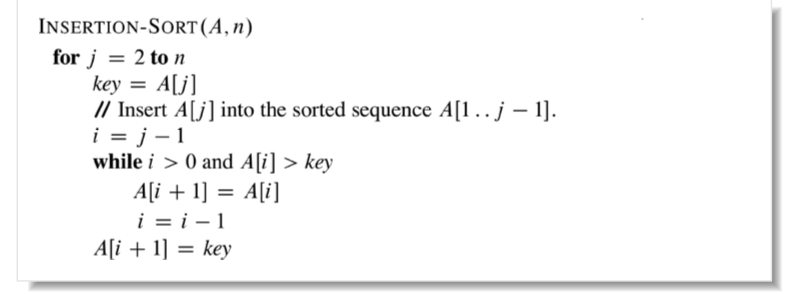
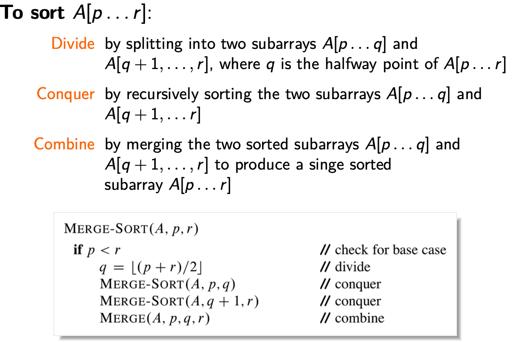
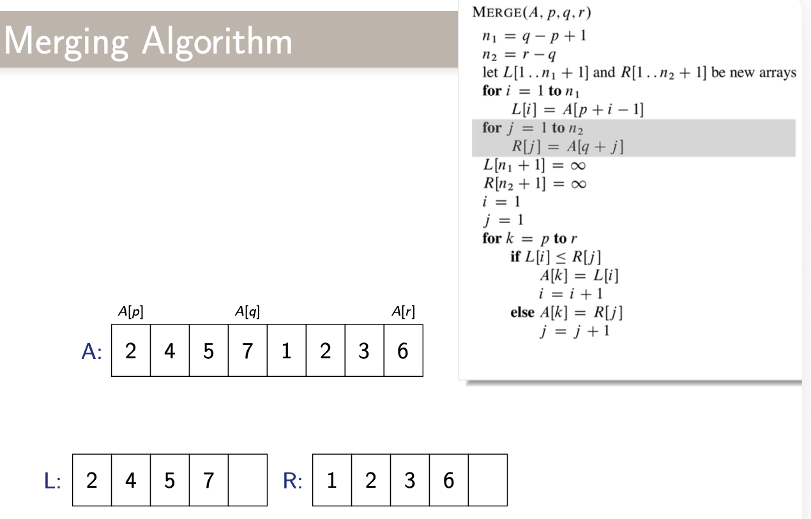
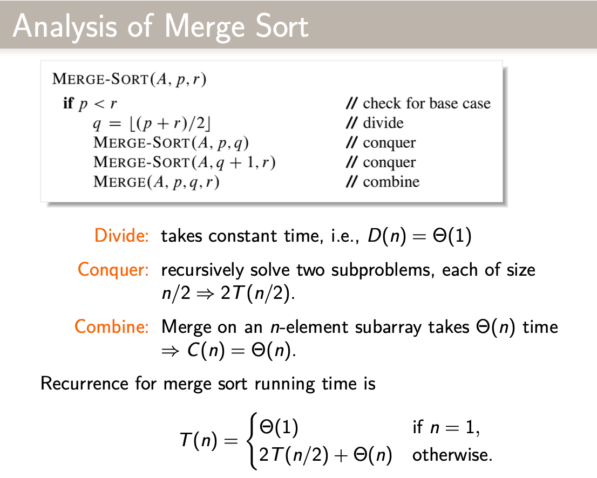
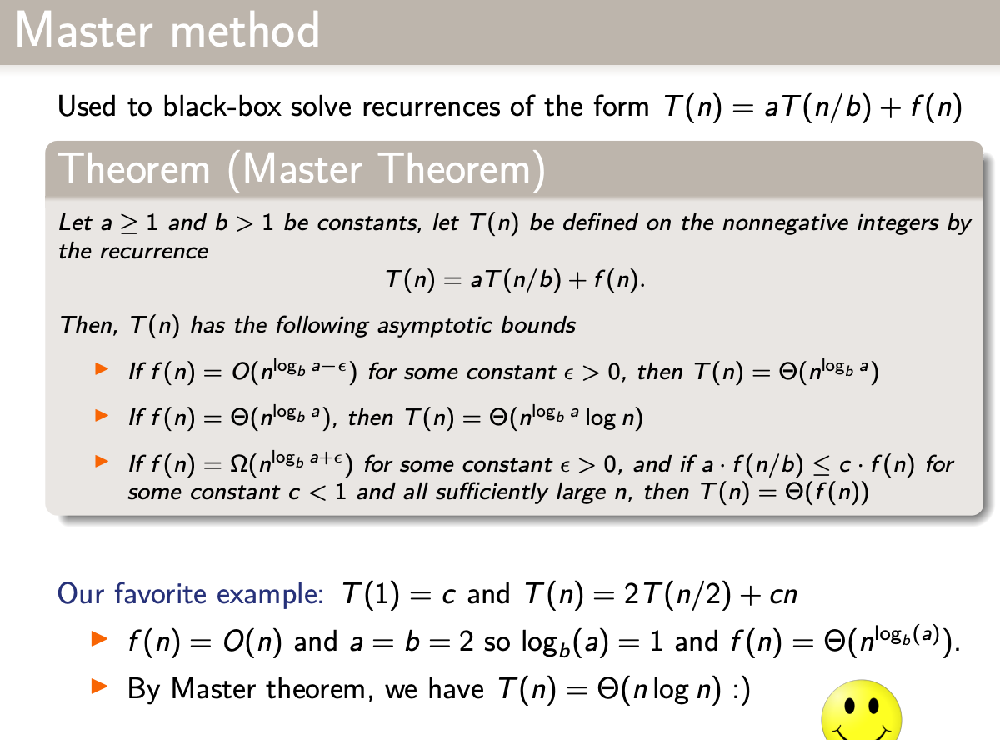
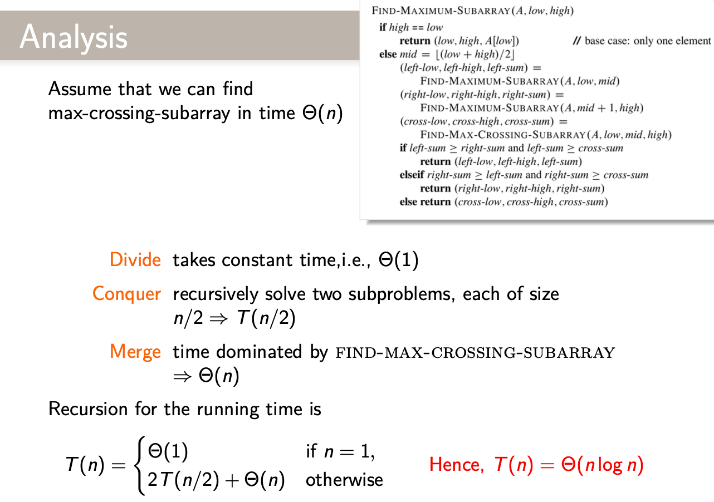
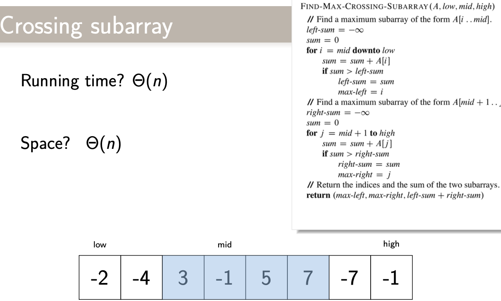

The difference between a bad programmer and a good one is whether the programmer considers **CODE** or **DATA STRUCTURES** more important. Bad programmers worry about the code. GOod programmers worry about **DATA STRUCTURES** and **THEIR RELATIONSHIPS**.

-- Linus Torvalds (creator of linus)

ALgorithms + Data structures = Programs
 
--Niklaus Wirth (Turing award winner from Switzerland)

“Informally, an algorithm is any well-defined computational procedure that takes some value, or set of values as input and produces some value, or set of values, as output. An algorithm is thus a sequence of computational steps that transform the input into the output.”

Running time analysis:
A computational model: random-access machine (RAM) model:
1. instructions are executed one after another
2. Simplification basic instructions take constant time O(1)
   1. Arithmetic: add, subtract, multiply, divide, remainer, floor, ceilling
   2. data movement: load, store, copy
   3. control: conditional/unconditional branch, subroutine call and return
3. Precision does not matter here

Time it taks depend on the input
1. size of input
2. good / bad input with the same size

Usually focus on **worst case running time**
Focus on the important feasutres:
1. drop lower-order terms
2. ignore the constant coef. in the leading term

O(·): upper limit (>= worst case)
Ω(·): lower limit (<= best case)
⍵(·): tight limit (O = Ω)
o(·): strictly lower than: n = o(nlogn)
θ(·): strictly larger than nlogn = ⍵(n)

Start:
1. Insertion sort: θ(n^2) in place
   1. start with an empty left hand of playing cards and the cards face down
   2. remove one card at a time from the table, insert it into the correct position in the left hand by comparing it with each of the cards in the hand from right to left
   3. 
2. Loop invariant:
   1. at the start of each iteration of the outer ffor loop, the loop indesxed by j-, the subarray A[1,...,j-1] consists of the elements originally in  A]1,...,j-1] but in sorted order
   2. verification by induction
      1. initialization: true prior to the first iteration
      2. mantenance: if true before, true afterwards
      3. termination: when the loop terminates, the invariant gives a useful property showing that the algo. is correct.
3. Merge sort: divide and conquer T(n) = θ(nlogn) not in place
   1. **Divide** the problem into a number of subproblems of the same kind θ(1)
   2. **conquer** the subproblems by solving them recursively -- T(n/2)
   3. **Combine** the subproblem solutions to give the final solution -- θ(n)
   
   
   

4. Recurence solution:
   1. **substitution**: guess the form of solution, use math induction to find the constants showing that the solution works
   2. **recursionTree**: plot a tree and generate the guess by the tree width and depth, then verify by substitution method
   3. **masterTheorem**
   
   4. n-1 <= $\lfloor n \rfloor$ <= n &; n <= $\lceil n \rceil$  <= n+1

5. Maximum-subarray problem:
   1. Brute force: θ(n^2)
   2. **Divide** the subarray into 2 subarrays of equal size if possible
   3. **Conquer** by finding the maximum subarrays of A[low ... mid] and A[mid+1 ... high]
   4. **Combine** by finding a max subarray crossing the midpoint and use the best of the three
   
   